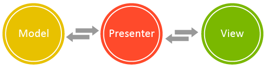
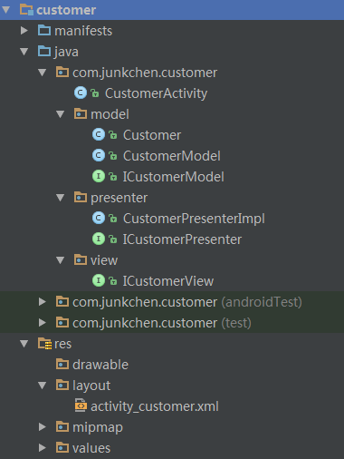
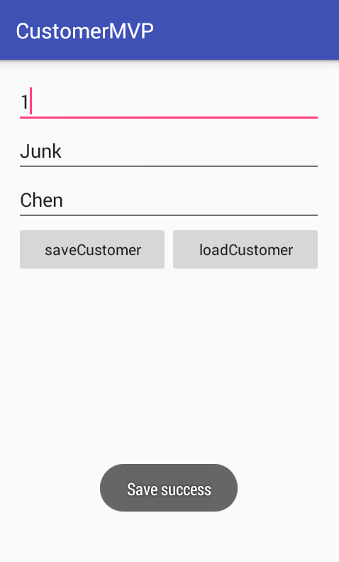

# **Android MVP 模式应用实例展示** #

## **一、概述** ##

**MVP** 即** Model - View - Presenter ** 。 Model 提供数据，View 负责显示，Presenter 负责逻辑处理。    

- **View**： 对应于 Activity ， 负责 View 的绘制以及用户交互。  

- **Model**： 依然是业务逻辑和实体模型

- **Presenter**： 负责完成 View 和 Modle 之间的交互

The **MVP** pattern stands for Model-View-Presenter, and it separates the UI concerns between the data of the UI (**Model**), the display of the UI (**View**), and the logic of the UI (**Presenter**). For Android, the View is the Activity, which will handle gathering user input and updating the display; the Presenter is a class that will handle communication between the Model and View; the Model will handle persisting and retrieving data, along with any business logic that the data must adhere to. Interfaces will be used to de-couple each of these components.   

  

**单一职责原则**（SRP：Single responsibility principle）又称单一功能原则  

### **MVP 优点** ###

- 分离了视图逻辑和业务逻辑，降低了耦合

- Activity 只处理生命周期的任务，代码变得更加简洁

- 试图逻辑和业务逻辑分别抽象到了 View 和 Presenter 的接口中，提高代码阅读性

- Presenter 抽象成接口，可以有多种具体的实现，方便进行单元测试

- 将业务逻辑抽到 Presenter 中，避免后台线程引用 Activity 导致 Activity 的资源无法被系统回收从而引起内存泄露和 OOM


## **MVP 设计技巧** ##

先设计 View  和 Model，最后设计 Presenter 。  

View 主要是定接口，有些情况下没有 Model 。

## **Sample** ##

理论需要付诸实践，下面就来写个 MVP 模式应用的示例，看看在项目中具体如何应用,如何将 View 与 Model 进行完美分离，而采用 Presenter 进行交互。下面举个加载保存用户的例子：  

项目整体结构图：  

  

效果图：  



### **View** ###

View 中主要设计接口,只做 UI 显示相关的。  

```.java
public interface ICustomerView {
    void setCustomerId(int id);
    void setCustomerFirstName(String firstName);
    void setCustomerLastName(String lastName);
    int getCustomerId();
    String getCustomerFirstName();
    String getCustomerLastName();
    void showSaveResult(String result);
    void showLoadFailedInfo();
}
```

### **Model** ###

Model 中设计数据模型，提供 UI 显示需要的数据内容。  

首先我们需要一个实体对象 Customer ：  

```.java
public class Customer {
    private int id;
    private String firstName;
    private String lastName;

    //Omit to write set and get method
	...
}
```

接着在设计一个 Customer 的接口 ICustomerModel ,这里面主要是 保存和加载用户：  

```.java
public interface ICustomerModel {
    boolean saveCustomer(String firstName, String lastName);
    Customer loadCustomer(int id);
}
```

最后实现接口：  

```.java
public class CustomerModel implements ICustomerModel {
    @Override
    public boolean saveCustomer(String firstName, String lastName) {
        return true;
    }

    @Override
    public Customer loadCustomer(int id) {
        Customer customer = new Customer();
        customer.setFirstName("Junk");
        customer.setLastName("Chen");
        return customer;
    }
}
```

### **Presenter** ###

设计完 View 和 Model 后，就可以设计 Presenter ，它主要是完成 View 与 Model 之间的交互、数据传递。在 Presenter 中会获得 View 的引用，实例化 Model 。  

这里我依然是先设计了一个 ICustomerPresenter 接口，定义了 保存和加载用户的两个方法：  

```.java
public interface ICustomerPresenter {
    void saveCustomer(final String firstName, final String lastName);
    void loadCustomer(final int id);
}
```

然后我实现这个接口：  

```.java
public class CustomerPresenterImpl implements ICustomerPresenter {
    private static final String TAG = "CustomerPresenterImpl";
    private ICustomerModel customerModel;
    private ICustomerView customerView;

    public CustomerPresenterImpl(ICustomerView customerView) {
        this.customerView = customerView;
        customerModel = new CustomerModel();
    }

	@Override
    public void saveCustomer(final String firstName, final String lastName) {
        if (firstName.isEmpty() || lastName.isEmpty()) {
            customerView.showSaveResult("first name or last name can't empty");
            return;
        }
        boolean isSaveSuccess = customerModel.saveCustomer(firstName, lastName);
        if (isSaveSuccess)
            customerView.showSaveResult("Save success");
        else
            customerView.showSaveResult("Save failed");
    }

	@Override
    public void loadCustomer(final int id) {
        if (id > 0) {
            Customer customer = customerModel.loadCustomer(id);
            customerView.setCustomerFirstName(customer.getFirstName());
            customerView.setCustomerLastName(customer.getLastName());
        } else {
            customerView.showLoadFailedInfo();
            customerView.setCustomerFirstName("");
            customerView.setCustomerLastName("");
        }
    }
}
```

### **Activity** ###

最后看看我们的 Activity 到底是什么样的呢？在 Activity 中会实例化 CustomerPresenterImpl 。  

```.java
public class CustomerActivity extends AppCompatActivity implements ICustomerView, View.OnClickListener {
    private static final String TAG = "CustomerActivity";
    private EditText edt_id, edt_firstName, edt_lastName;
    private Button btn_saveCustomer, btn_loadCustomer;

    private ICustomerPresenter mCustomerPresenter;

    @Override
    protected void onCreate(Bundle savedInstanceState) {
        super.onCreate(savedInstanceState);
        setContentView(R.layout.activity_customer);

        initView();
        mCustomerPresenter = new CustomerPresenterImpl(this);
    }

    private void initView() {
        edt_id = (EditText) findViewById(R.id.edt_id);
        edt_firstName = (EditText) findViewById(R.id.edt_firstName);
        edt_lastName = (EditText) findViewById(R.id.edt_lastName);
        btn_saveCustomer = (Button) findViewById(R.id.btn_saveCustomer);
        btn_loadCustomer = (Button) findViewById(R.id.btn_loadCustomer);

        btn_saveCustomer.setOnClickListener(this);
        btn_loadCustomer.setOnClickListener(this);
    }

    @Override
    public void onClick(View v) {
        switch (v.getId()) {
            case R.id.btn_saveCustomer: {
                mCustomerPresenter.saveCustomer(getCustomerFirstName(), getCustomerLastName());
                break;
            }
            case R.id.btn_loadCustomer: {
                mCustomerPresenter.loadCustomer(getCustomerId());
                break;
            }
        }
    }

    @Override
    public void setCustomerId(int id) {
        edt_id.setText(String.valueOf(id));
    }

    @Override
    public void setCustomerFirstName(String firstName) {
        edt_firstName.setText(firstName);
    }

    @Override
    public void setCustomerLastName(String lastName) {
        edt_lastName.setText(lastName);
    }

    @Override
    public int getCustomerId() {
        if (edt_id.getText().toString().isEmpty()) return 0;
        return Integer.parseInt(edt_id.getText().toString());
    }

    @Override
    public String getCustomerFirstName() {
        return edt_firstName.getText().toString();
    }

    @Override
    public String getCustomerLastName() {
        return edt_lastName.getText().toString();
    }

    @Override
    public void showSaveResult(String result) {
        Toast.makeText(this, result, Toast.LENGTH_SHORT).show();
    }

    @Override
    public void showLoadFailedInfo() {
        Toast.makeText(this, "No customer.", Toast.LENGTH_SHORT).show();
    }
}
```

可以看到在 Activity 中只是做与 UI 显示有关的事情，需要数据就去找 Presenter 。  

可以看到整个项目结构非常清晰，易理解。示例简单，抛砖引玉。  

> **欢迎加QQ群交流： 365532949**  
**Homepage: [http://junkchen.com](http://junkchen.com)**  
