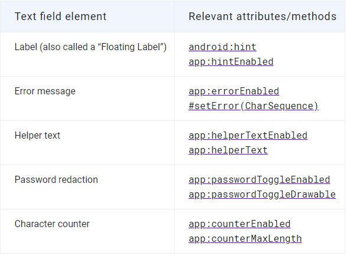

# Android TextInputLayout，打造 Material Design 风格的文本输入框


Android Material Design 对 EditText 输入框的交互设计定义了一个规范，设计细节可参考官网介绍： [MATERIAL DESIGN GUIDELINES: TEXT FIELDS](https://material.io/design/components/text-fields.html) 。**TextInputLayout** 提供了一种 Material 风格的文本输入框的实现。  

TextInputLayout 布局包装了一个 EditText 在用户输入文本隐藏提示时展示一个浮动的文本标签。    

## 用法

创建一个 Materail Design 风格的文本输入框，在你的 XML 布局文件中添加一个 **TextInputLayout**，并添加一个 **TextInputEditText** 作为  **TextInputLayout** 的直接子孩子。  

```xml
<com.google.android.material.textfield.TextInputLayout
    android:layout_width="match_parent"
    android:layout_height="wrap_content"
    android:hint="@string/hint_text">

  <com.google.android.material.textfield.TextInputEditText
      android:layout_width="match_parent"
      android:layout_height="wrap_content"/>

</com.google.android.material.textfield.TextInputLayout>
```

注： TextInputEditText 可以使用 EditText 代替，作为输入文本组件。EditText可以使用，但是 TextInputEditText 可以针对输入的文本提供更好的控制。  

### Materail 样式

#### Fill Box(Default) 颜色填充默认样式

填充的文本域有一个颜色填充的背景。可以直接在 TextInputLayout 中直接应用样式：  

```xml
style="@style/Widget.MaterialComponents.TextInputLayout.FilledBox"
```

可以通过 boxBackgroundColor 属性改变填充文本框的背景颜色。  

#### Outline Box（有边框填充）

```xml
style="@style/Widget.MaterialComponents.TextInputLayout.OutlinedBox"
```

可以通过 boxStrokeColor 和 boxStrokeWidth 两个属性改变边框的颜色和粗细。  

#### 圆角弧度

可以通过属性 boxCornerRadiusTopLeft，boxCornerRadiusTopRight，boxCornerRadiusBottomLeft， boxCornerRadiusBottomRight 设置左上、右上、左下、右下的圆角大小。  

## 通用特性

TextIInputLayout 提供了一个一些 Material 风格的文本输入框特性：  




Reference Resource:  

- [https://developer.android.com/reference/android/support/design/widget/TextInputLayout](https://developer.android.com/reference/android/support/design/widget/TextInputLayout)

- [https://material.io/develop/android/components/text-input-layout/](https://material.io/develop/android/components/text-input-layout/)

